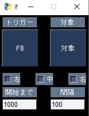

# render
  キーボードやマウスのボタンを連打してくれます
# 操作方法
   
  上の二つの「トリガー」「対象」ボタンを押すとそれぞれ入力受付状態になり、連打のトリガーにしたいキーや連打をしたいキーを押すことで登録されます。  
  「左」「中」「右」ボタンはマウスのボタンと対応しています。チェックを入れると連打の対象になります。  
  「開始まで」はトリガーとなるキーを入力してから連打が始まるまでの時間をミリ秒単位で設定できます。  
  「間隔」は連打の間隔をミリ秒単位で設定できます。
# 動作環境
  PySimpleGUI、keyboard、mouseライブラリをインストールしたら多分動きます。
